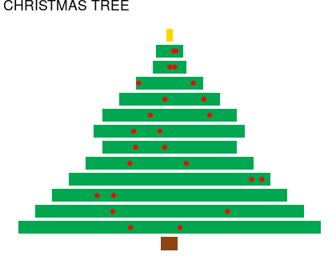

# Coding Christmas trees

## The challenge

To give ourselves a festive challenge, in December 2018's Coffee & Coding, we took inspiration from [this post](https://www.r-bloggers.com/christmas-trees/) and used the session to attempt to create a Christmas tree using code. 

People could either start from scratch or use a basic template and add improvements. 

## The results

Here are some of the images we produced in the session (and possibly with a bit of extra time after...)

Code artist: [MattFunnell](https://github.com/MattFunnell)

Code available: [Here](matt_tree_code.R)

Code artist: [MeganStodel](https://github.com/MeganStodel)

Code available: [Here](MS_tree_script.R)
